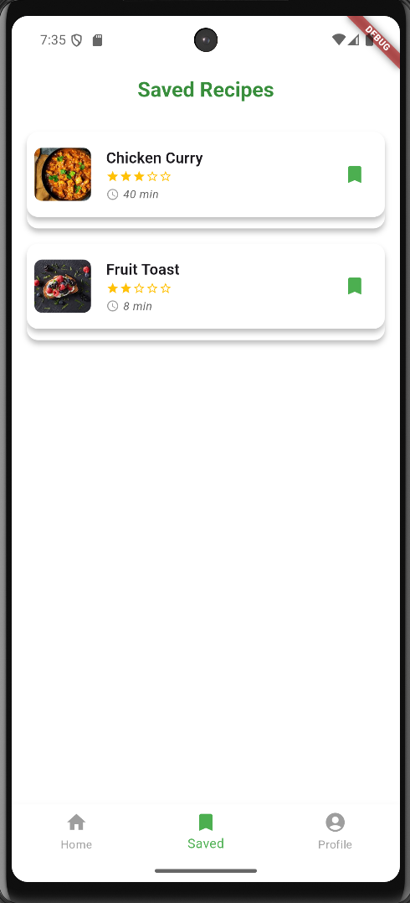

# 💸 Recipe App

A simple, intuitive Flutter app for food recipes. Users can view recipes, save recipes, and search as they need.

---

## 📱 Screenshots

| Home Screen | Add Expense | Expense Chart |
|-------------|--------------|----------------|
|  |  |  |

---

## 🚀 Features

- 📊 Visualize list of recipes
- 📝 Save recipes
- 📅 Filter recipes by type
- 💾 Persistent data with local storage

---

## 🛠️ Tech Stack

- **Flutter** – UI development
- **Dart** – Programming language
- **Local storage** – For saving transactions

---

## 🧑‍💻 How to Run

1. **Clone the repo**

   ```bash
   git clone https://github.com/Nirjal-shrestha14/recipe_app.git
   cd recipe_app
